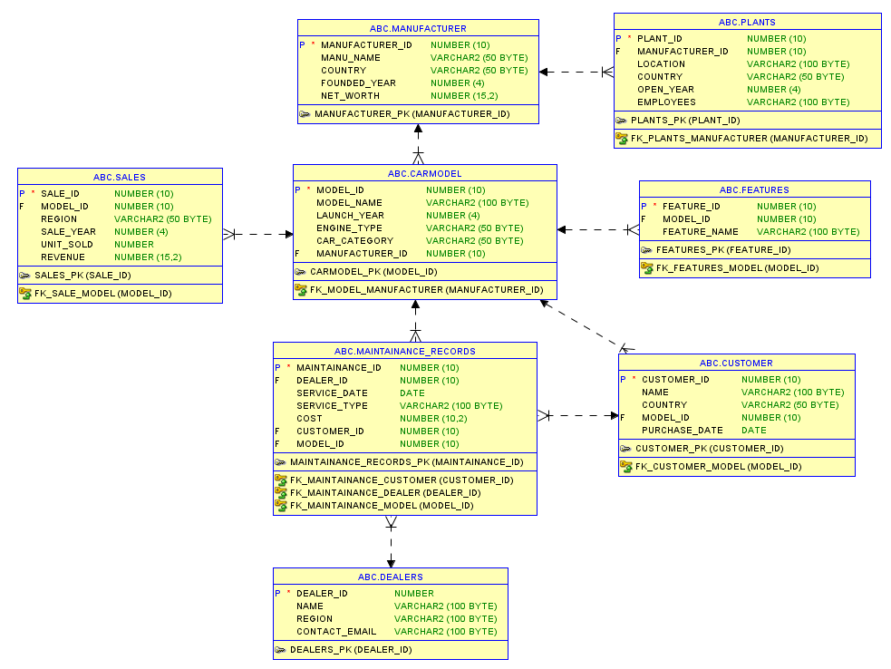
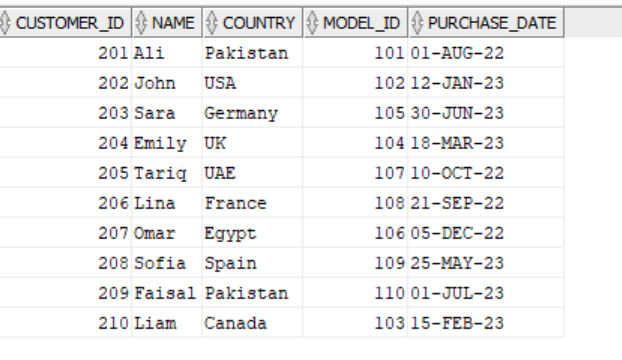
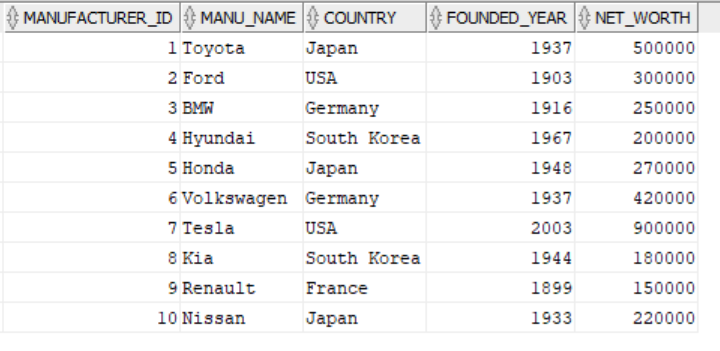
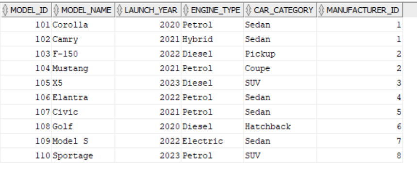

#  Global Car Manufacturer Database (Oracle SQL)


This project presents a relational database schema designed for a **Global Car Manufacturing Company**, modeled through a comprehensive Entity-Relationship Diagram (ERD). The goal is to represent real-world automotive operations including customer relationships, production, maintenance, and dealership networks.

##  Table of Contents
- [Key Features](#-key-features)
- [Database Schema](#-database-schema)  
- [Relationships](#-relationships)
- [Installation](#-installation)  
- [Sample Data](#-sample-data)
- [Usage Examples](#-usage-examples)
- [Data Model](#-data-model)


##  Key Features
This database project includes well-structured relational models representing:

- **Customers** 
    - Track detailed customer profiles along with their purchase histories linked to specific car models.
- **CarModel** 
    - Capture car models, variant types, engine types, and associate them with production plants and timelines.
- **Maintenance records** 
    - Store and manage complete service logs for every vehicle, including service types, costs, and service dates.
- **Dealerships and sales**
    - Map vehicle sales to authorized dealerships, enabling regional performance analysis and sales reporting.
- **Plants and Features**
    - Link manufacturing plants with vehicles and define vehicle-specific features like sunroof, navigation system, etc.
- **Strong and Weak Entity Design**
    - Implements relationships such as Customer → Vehicle and Vehicle → Maintenance using appropriate ERD symbols.
- **Referential Integrity Using Keys**
   - Carefully defined primary and foreign key constraints for robust and scalable data consistency.


##  Database Schema

This is the schema diagram of Global Car Manufacturer Database :



## Relationships

### 🔹 1. **Customer → CarModel**
- **Many-to-One**  
  Each customer purchases **one car model**, but a car model can be purchased by **many customers**.  
  **FK**: `Customer.model_id → CarModel.model_id`
----
### 🔹 2. **Customer → Dealership**
- **Many-to-One**  
  Each customer is associated with **one dealership**, but a dealership can have **many customers**.  
  **FK**: `Customer.dealer_id → Dealership.dealer_id`
----
### 🔹 3. **CarModel → Maintenance_Record**
- **One-to-Many**  
  A car model can have **multiple maintenance records**, but each maintenance record belongs to **one model**.  
  **FK**: `Maintenance_Record.model_id → CarModel.model_id`
----
### 🔹 4. **CarModel → Plant**
- **Many-to-One**  
  A car model is produced in **one plant**, but a plant can produce **many car models**.  
  **FK**: `CarModel.plant_id → Production_Plant.plant_id`
----
### 🔹 5. **CarModel → Features**
- **Many-to-Many**  
  A car model can have **multiple features**, and a feature can belong to **multiple car models**.  
  **Join Table**: `Model_Feature(model_id, feature_id)`
----
### 🔹 6. **Manufacturer → CarModel**
- **One-to-Many**  
  A manufacturer can produce **multiple car models**, but each car model is produced by **one manufacturer**.  
  **FK**: `CarModel.manufacturer_id → Manufacturer.manufacturer_id`
----

##  Installation

1. Clone the repository:
```
  git clone https://github.com/username/Global-Car-Manufacturer-Database.git
  cd Global-Car-Manufacturer-Database
```
2. Open your preferred RDBMS (MySQL, Oracle, etc.)
3. Create the schema using the ERD and SQL scripts .
4. Insert sample data

## Sample Data

### Customer Records



### Manufacturer Records


### Model Records



## Usage Examples

1. Get all car models manufactured by a specific manufacturer

```
SELECT MODEL_NAME, LAUNCH_YEAR, ENGINE_TYPE
FROM CARMODEL
JOIN MANUFACTURER ON CARMODEL.MANUFACTURER_ID = MANUFACTURER.MANUFACTURER_ID
WHERE MANU_NAME = 'Toyota';
```
2. Find total units sold and revenue for each model

```
SELECT CM.MODEL_NAME, SUM(S.UNIT_SOLD) AS TOTAL_UNITS, SUM(S.REVENUE) AS TOTAL_REVENUE
FROM SALES S
JOIN CARMODEL CM ON S.MODEL_ID = CM.MODEL_ID
GROUP BY CM.MODEL_NAME;

```
3. List customers and the features of the model they purchased

```
SELECT C.NAME AS CUSTOMER_NAME, CM.MODEL_NAME, F.FEATURE_NAME
FROM CUSTOMER C
JOIN CARMODEL CM ON C.MODEL_ID = CM.MODEL_ID
JOIN FEATURES F ON CM.MODEL_ID = F.MODEL_ID;

```
4. Get maintenance records for a particular customer
```
SELECT M.SERVICE_DATE, M.SERVICE_TYPE, M.COST
FROM MAINTAINANCE_RECORDS M
JOIN CUSTOMER C ON M.CUSTOMER_ID = C.CUSTOMER_ID
WHERE C.NAME = 'John Doe';

```
5. Show total revenue by region

```
SELECT REGION, SUM(REVENUE) AS TOTAL_REVENUE
FROM SALES
GROUP BY REGION;
```

## Data Model

View full ERD of this : [click here ](global_car_ERD.pdf)

### Entities:

- Manufacturer
- CarModel
- Customer
- Plants
- Sales
- Features
- Dealers
- Maintainance_Records

### Key Notations:

- Primary Keys: Underlined in ERD
- Foreign Keys: Dashed connectors in ERD
- Weak Entities: Clearly marked if any(doted rectangle)
- Many-to-Many Relationships: via bridge tables (e.g., model-features)
