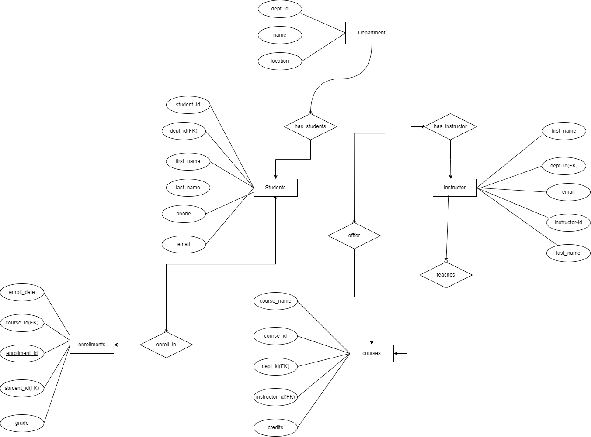
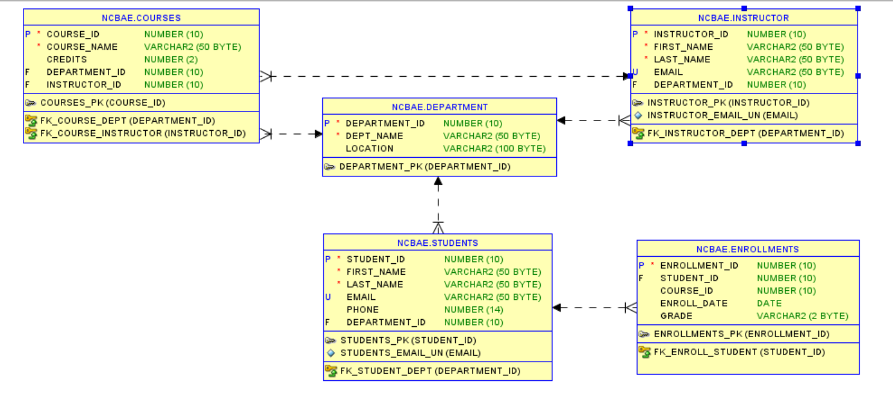
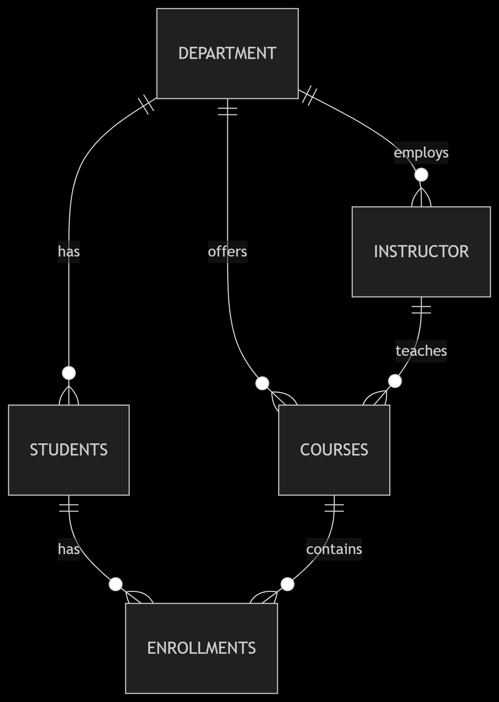
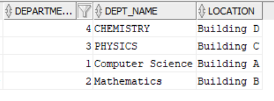
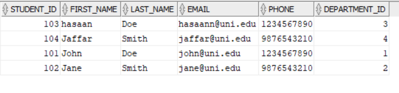
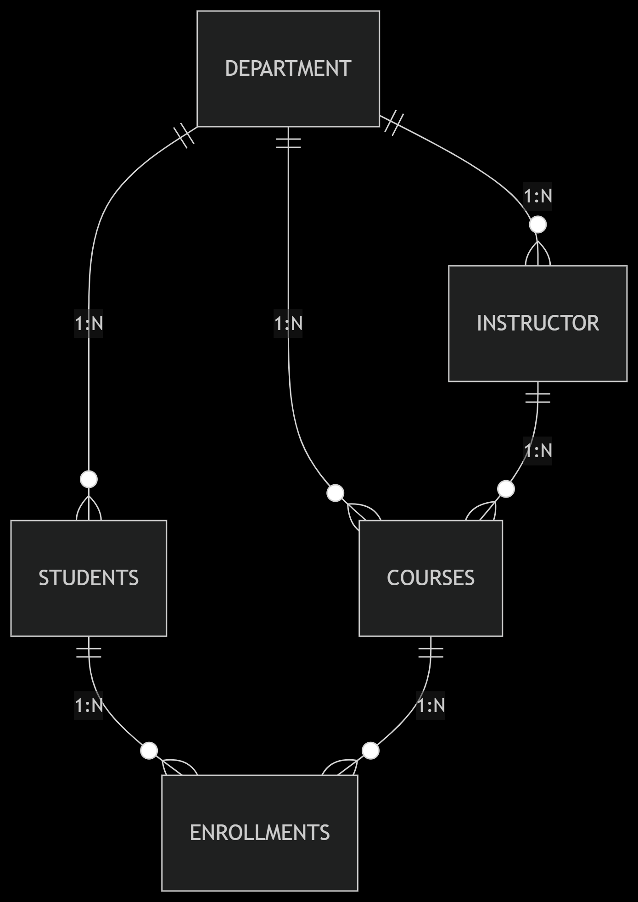

###  University Student Management System (Oracle SQL)



A complete Oracle database solution for managing university students, courses, departments, and enrollments.

##  Table of Contents
- [Key Features](#-key-features)
- [Database Schema](#-database-schema)  
- [Relationships](#-relationships)
- [Installation](#-installation)  
- [Sample Data](#-sample-data)
- [Usage Examples](#-usage-examples)
- [Data Model](#-data-model)


##  Key Features

- **Department Management**  
  - Create and organize academic departments with locations.
- **Student Records**  
  - Store personal details with email uniqueness validation.
- **Instructor Management**  
  - Maintain faculty information with department assignments.
- **Course System**  
  - Manage course catalog with credit values.
  - Assign instructors to courses.
- **Enrollment Tracking**  
  - Record student enrollments with automatic date stamping.
  - Store grade information.

##  Database Schema



##  Relationships



##  Installation

##### Prerequisites
- Oracle Database 11g or later
- SQL*Plus or Oracle SQL Developer
- 50MB free storage space

### Setup Steps
1. Clone the repository:

   ```bash

   git clone https://github.com/yourusername/student-management-db.git
   cd student-management-db

   ```
2. Execute the SQL scripts:

```
-- Create tables
@schema.sql

-- Load sample data
@sample_data.sql

```
3. Verify installation:

```
SELECT *  FROM tab;

```

## Sample Data

### Department Records




### Student Records




## Usage Examples

1. Get All Enrollments with Grades :

```
SELECT s.student_id, s.first_name, c.course_name, e.grade
FROM enrollments e
JOIN students s ON e.student_id = s.student_id
JOIN courses c ON e.course_id = c.course_id;

```

2. Find Courses Without Instructors :

```
SELECT course_id, course_name 
FROM courses
WHERE instructor_id IS NULL;
```
3. Department Enrollment Statistics :

```
SELECT d.dept_name, COUNT(e.enrollment_id) AS enrollments
FROM department d
LEFT JOIN courses c ON d.department_id = c.department_id
LEFT JOIN enrollments e ON c.course_id = e.course_id
GROUP BY d.dept_name;
```

## Data Model




| Constraint            | Description                          |
|-----------------------|--------------------------------------|
| `PK_*`                | Primary keys on all ID columns       |
| `FK_STUDENT_DEPT`     | Students → Department linkage        |
| `FK_COURSE_INSTRUCTOR`| Courses → Instructor relationship    |
| `EMAIL_UNIQUE`        | Unique email constraints             |
